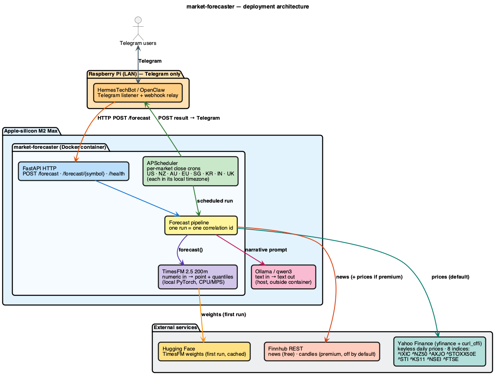
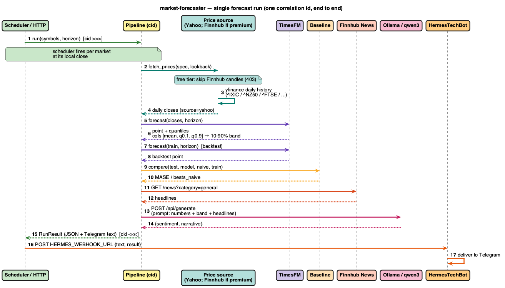
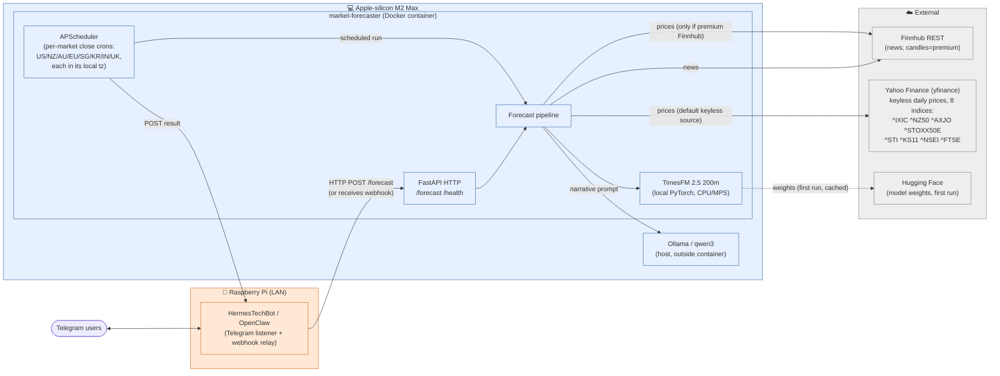

# Architecture

Mermaid source is kept in-repo (not pre-rendered) so the diagrams stay versioned
and update with the code. GitHub renders these automatically.

The same architecture + sequence are also provided as editable, colored,
thick-lined diagrams:

| Diagram | draw.io (editable) | PlantUML (editable) | PNG preview |
|---|---|---|---|
| Architecture / deployment | [`architecture.drawio`](architecture.drawio) | [`architecture.puml`](architecture.puml) | [`architecture.png`](architecture.png) |
| Single-run sequence | [`sequence.drawio`](sequence.drawio) | [`sequence.puml`](sequence.puml) | [`sequence.png`](sequence.png) |

> Open `.drawio` files at [app.diagrams.net](https://app.diagrams.net) (or the VS Code
> "Draw.io Integration" extension). The `.png` files are generated previews of the
> `.puml` sources — regenerate after edits with:
>
> ```bash
> plantuml -tpng docs/architecture.puml docs/sequence.puml
> ```

### Architecture preview



### Sequence preview



## Deployment topology (what runs where)

The deployment boundary is explicit: the **Raspberry Pi** only runs the Telegram
bot, and the **M2 Max** runs this service plus the heavy model and Ollama.



## Single forecast run (sequence)

One run == one correlation id, logged with `>>>` / `<<<` markers across every hop.

```mermaid
sequenceDiagram
    autonumber
    participant SCH as Scheduler / HTTP
    participant PIPE as Pipeline (cid)
    participant DS as Price source (Yahoo; Finnhub if premium)
    participant TFM as TimesFM
    participant BL as Baseline
    participant FH as Finnhub News
    participant OLL as Ollama/qwen3
    participant HB as HermesTechBot

    SCH->>PIPE: run(symbols, horizon)  [cid >>>]
    Note over SCH,PIPE: scheduler fires per market at its local close
    PIPE->>DS: fetch_prices(spec, lookback)
    Note over DS: free tier: skip Finnhub candles (403)
    DS->>DS: yfinance daily history (^IXIC / ^NZ50 / ^FTSE / ...)
    DS-->>PIPE: daily closes (source=yahoo)
    PIPE->>TFM: forecast(closes, horizon)
    TFM-->>PIPE: point + quantiles\n(cols [mean, q0.1..q0.9] -> 10–90% band)
    PIPE->>TFM: forecast(train, horizon)  [backtest]
    TFM-->>PIPE: backtest point
    PIPE->>BL: compare(test, model, naive, train)
    BL-->>PIPE: MASE / beats_naive
    PIPE->>FH: GET /news?category=general
    FH-->>PIPE: headlines
    PIPE->>OLL: POST /api/generate (prompt: numbers + band + headlines)
    OLL-->>PIPE: {sentiment, narrative}
    PIPE-->>SCH: RunResult (JSON + Telegram text)  [cid <<<]
    SCH->>HB: POST HERMES_WEBHOOK_URL {text, result}
    HB->>HB: deliver to Telegram
```

## Two models, side by side

The repo deliberately keeps the two model types in separate modules so the
contrast is obvious:

| | TimesFM (`forecast/timesfm_forecaster.py`) | qwen3 (`narrative/ollama.py`) |
|---|---|---|
| Input | numeric array (closes) | text (headlines + numbers) |
| Output | point + quantile array | text (sentiment + narrative) |
| Interface | no prompt, no tokens | prompt-based |
| Runs on | local PyTorch (CPU/MPS) | Ollama on host |
